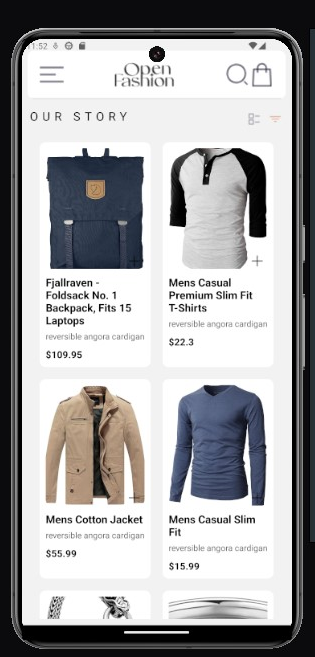
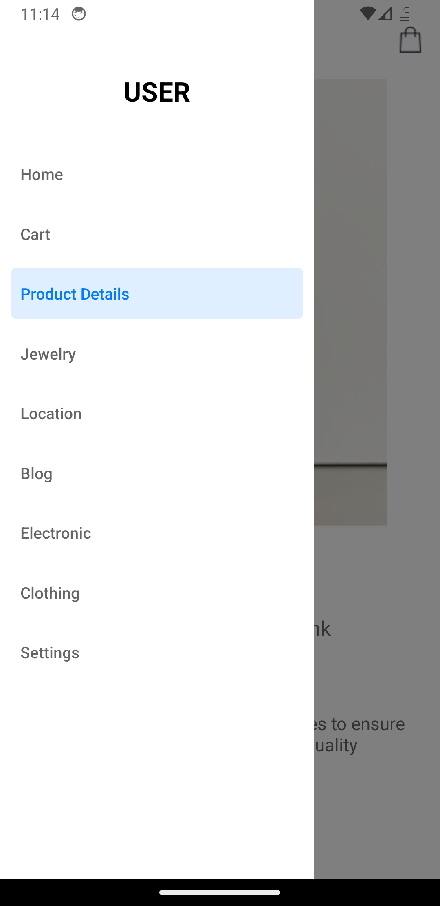
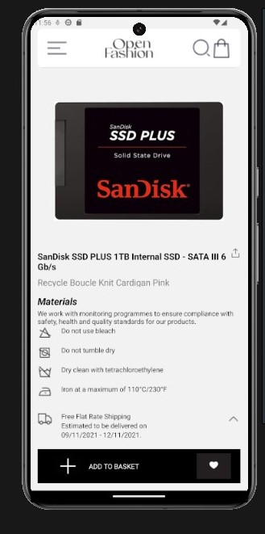
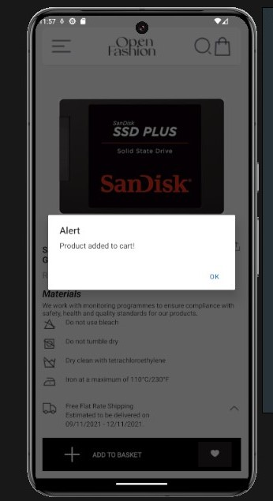
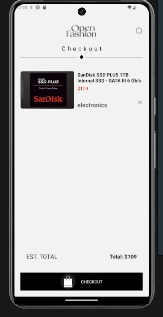

# E-Commerce App

# Overview

This project is a React Native e-commerce application designed to provide users with a seamless shopping experience. It includes components for displaying product lists, detailed product information, and managing a shopping cart. The app uses React Navigation for navigation and AsyncStorage for persistent storage.

# Features

- HomeScreen: Displays a list of available products fetched from an external API.
- ProductDetailScreen: Shows detailed information about a selected product.
- CartScreen: Displays the items added to the cart.
- Drawer Navigation: Accessible through a swipe gesture or button, providing easy access to different screens.
- Add to Cart Button: Allows users to add products to their cart from the product list or product detail screen.
- Remove from Cart Button: Enables users to remove items from their cart.

# Functionality

Users should be able to:

- View a list of available products fetched from an external API.
- Preview detailed information about a product.
- Add products to their cart.
- Remove products from their cart.
- View the items in their cart.

# Screenshots

